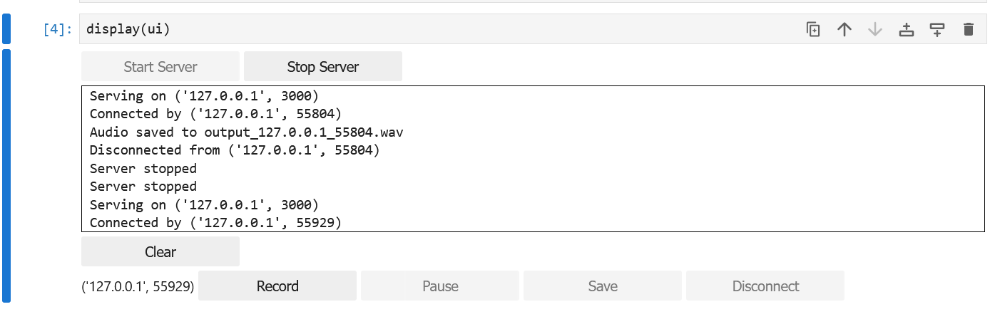

# Инструкция

## Voicemeeter

* Примерная конфигурация для Voicemeeter Banana

## Сервер

### Требования

* python 3.11
* poetry для установки зависимостей

### Запуск

* Загрузить на сервер Jupyter Lab файл `server.ipynb`
* Запустить все ячейки, появится UI сервера

## Клиент

### Требования

* python 3.11
* poetry для установки зависимостей

### Запуск

* `cd ./client`
* `poetry install`
* Исправить в `client/config.toml` адрес и порт
* `poetry run python .\client-simple.py`
* `start`
* Ввести ID устройства, например 54 для `Device 54: Voicemeeter Out B1 (VB-Audio Voicemeeter VAIO) (Channels: 2)`
* Успешное подключение можно посмотреть на сервере Jupyter Notebook
* Остановить запись устройства можно командой `stop`, затем выбрать ID
* Чтобы выйти - команда `exit`